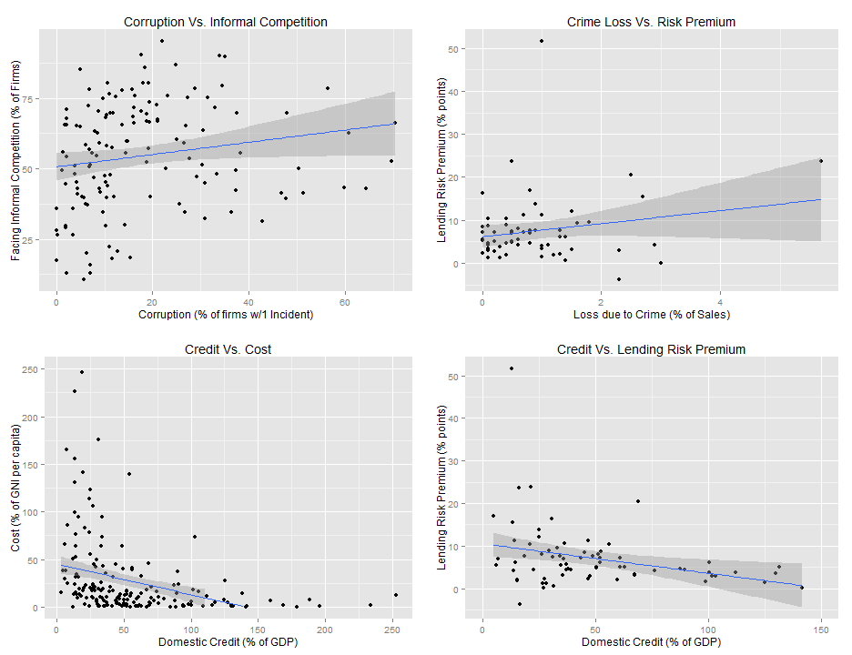

# Exploratory Data Analysis for Project Proposal

### Author: Jigme Norbu

How do you decide on where to start your business? How do you know if your business is likely to thrive or fail? How much is it going to cost? ... I am sure there are lot of entrepreneurs and investors alike, who are interested in learning the answers to such questions. Due to rapid globalization and the rise of international firms, the whole world has become a platform for startup businesses. We don't have to restrict our entrepreneurial ideas to just the national jurisdiction. Hence, not only does having awareness of the economic situations in different parts of the world impact our investment decisions but it also enables us to make informed decisions. Provided the right methodology, data analysis can help further that awareness. 

To answer such questions, I am interested in using the data set made available by the Work Bank and the United Nations. Both of these organizations provide API for free access to huge data set. To provide a glimpse of possible analyses and insights that can be garnered from the data, I collected a smaller sample (cross-section data) of the panel data. As part of my exploratory data analysis. After doing some data cleaning and processing, I looked into the correlations between my variables. Often times we can learn a lot from just the way the variables are correlated. They also provide interesting relationships that we can explore further.

For the first part of my analysis, I looked into the relationship between cost of starting a new business (measured in terms of percentage of Gross National Income) and domestic credits available for private sectors (measured in terms of percentage of GDP).  In addition, I categorized this relationship by the population density (persons per sq. km) and the regions.  In this plot (1st Plot), it is interesting to note that, high income (OECD) countries have high domestic credits available for private sectors and as well as lower startup cost for businesses. Whereas, Sub-Saharan African countries have high startup cost and low domestic credits available. 

Next, I am interested in looking at what are the good indicators for a startup friendly environment. For this, I looked into four different relationships. In the 2nd plot, the first graph is the relationship between Corruption (measured as a percentage of firms involved in at least one corruption incidence) and Facing Informal Competition (measured as % of firms facing it). Informal firms are the firms that are not legally registered. I fitted a linear model to it to understand the relationship better. It is yet again interesting to see that the percentage of firms facing the informal competition is higher for highly corrupt country. Similarly, in the second graph (Crime Loss Vs. Risk Premium), lending risk premium (prime lending rate minus treasury bill rate) is positively correlated with  loss due to crimes ( as % of Sales). 

In the 3rd graph, I plotted domestic credit and startup cost (like the 1st plot) at individual country level and yet again I found the relationship to be negative. In the 4th graph (Credit Vs. Risk Premium), we get an intuitive negative relationship between the level of domestic credits available for private sector and the lending risk premium  (i.e. higher credits is associated with lower risk premium). 

We can already get a sense of what kind of environment should we consider for investment. For instance, if the risk premium is low, then a business can take cheaper loans. If the corruption is high, you might want to think about the informal competitions you might face. There are lot of things we can analyse from this point onward. Thanks to the larger data set that I can access with more techniques, I believe the prospect of this project is vast. 

## The Data

I used the World Bank's website to download all my data in .xls format. Then I converted them into .csv format and loaded it into R:


```r
setwd("C:/Users/Jigme505/Desktop/Data Incubator Project/")

economy_size_df <- read.csv("WB dataset/1_size_of_the_economy.csv", na.strings = "..")
private_sector_df <- read.csv("WB dataset/2_private_sector_in_the_economy.csv", na.strings = "..")
enterprise_survey_df <- read.csv("WB dataset/3_business_environment_enterprise_survey.csv", na.strings = "..")
doing_business_ind_df <- read.csv("WB dataset/4_business_environment_Doing_business_indicators.csv", na.strings = "..")
stock_markets_df <- read.csv("WB dataset/5_stock_markets.csv", na.strings = "..")
finan_acss_stab_and_effi_df <- read.csv("WB dataset/6_Financial_access_stability_and_efficiency.csv", na.strings = "..")
tax_policies_df <- read.csv("WB dataset/7_tax_policies.csv", na.strings = "..")
military_exp_df <- read.csv("WB dataset/8_military_expenditure_and_arms_transfers.csv", na.strings = "..")
power_communication_df <- read.csv("WB dataset/9_power_and_communications.csv", na.strings = "..")
information_society_df <- read.csv("WB dataset/10_the_information_society.csv", na.strings = "..")
sci_and_tech_df <- read.csv("WB dataset/11_science_and_technology.csv", na.strings = "..")
```

## Collecting the relevant variables


```r
economy_size_df_n <- economy_size_df[-c(1:3, 232:309),]
countries <- as.character(economy_size_df_n$X)
population <- as.numeric(as.character(economy_size_df_n$Population))
GNI <- as.numeric(as.character(economy_size_df_n$Gross.national.income..Atlas.method))
GNI_per_capita <- as.numeric(as.character(economy_size_df_n$Gross.national.income.per.capita..Atlas.method))
pop_density <- as.numeric(as.character(economy_size_df_n$Population.density))
PPP_GNI <- as.numeric(as.character(economy_size_df_n$Purchasing.power.parity.gross.national.income))
PPP_per_capita <- as.numeric(as.character(economy_size_df_n$X.1))
GDP <- as.numeric(as.character(economy_size_df_n$Gross.domestic.product))
GDP_per_capita <- as.numeric(as.character(economy_size_df_n$X.2))

##
private_sector_df_n <- private_sector_df[-c(1:3, 232:298),]
dom_crdt_to_priv_sec <- as.numeric(as.character(private_sector_df_n$Domestic.credit.to.private.sector)) #as % of GDP
new_business_registered <- as.numeric(as.character(private_sector_df_n$Businesses.registered))

##
enterprise_survey_df_n <- enterprise_survey_df[-c(1:3,232:316),]
reg_and_tax_time <- as.numeric(as.character(enterprise_survey_df_n$Regulations.and.tax)) # % of the senior managment time
num_visit_tax_office <- as.numeric(as.character(enterprise_survey_df_n$X.1)) 
licenses_obt_time <- as.numeric(as.character(enterprise_survey_df_n$Permits.and.licenses))  # time taken to get operating license
corruption <- as.numeric(as.character(enterprise_survey_df_n$Corruption)) # % of firms w/atleast 1 Bribery incidence
crime <- as.numeric(as.character(enterprise_survey_df_n$Crime))  # % of sales lost due to crime
informal_compete <- as.numeric(as.character(enterprise_survey_df_n$Informality)) # % of firms competing with unregistered firms
finanacing <- as.numeric(as.character(enterprise_survey_df_n$Finance)) # % of firms using banks to finance working capital
trade <- as.numeric(as.character(enterprise_survey_df_n$Trade)) # avg time(days) to clear exports through custom
training_workforce <- as.numeric(as.character(enterprise_survey_df_n$Workforce)) # % of firms offering formal training

##
doing_business_ind_df_n <- doing_business_ind_df[-c(1:3, 232:363),]
starting_bness_process <- as.numeric(as.character(doing_business_ind_df_n$Starting.a.business)) # number of procedures required to start a business
starting_bness_time <- as.numeric(as.character(doing_business_ind_df_n$X.1))  # time (days) required to start a business
starting_bness_cost <- as.numeric(as.character(doing_business_ind_df_n$X.2))  # cost of starting business as % of per capita income

## 
finan_acss_stab_and_effi_df_n <- finan_acss_stab_and_effi_df[-c(1:3, 232:338),]
risk_premium_lending <- as.numeric(as.character(finan_acss_stab_and_effi_df_n$Risk.premium.on.lending))    # Prime lending rate minus treasury bill rate

##
sci_and_tech_df_n <- sci_and_tech_df[-c(1:3, 232:326),]
RD_expenditure <- as.numeric(as.character(sci_and_tech_df_n$Expenditures.for.R.D))    # % of GDP

## 
stock_markets_df_n <- stock_markets_df[-c(1:3, 232:300),]
market_capitalization <- as.numeric(as.character(stock_markets_df_n$X.1))         # market capitalization (2012) [no.of shares x outstanding share prices]

##
tax_policies_df_n <- tax_policies_df[-c(1:3, 232:310),]
business_tax_total <- as.numeric(as.character(tax_policies_df_n$X.6))   # total tax(including, profit, labor, others) tax payable by bussinesses as % of commercial profit
```

## Creating a new data frame and subdata

```r
newdata<- data.frame(countries,population, pop_density, GNI, 
                           GNI_per_capita, GDP, GDP_per_capita, PPP_GNI, PPP_per_capita,
                           dom_crdt_to_priv_sec, new_business_registered,reg_and_tax_time, 
                           num_visit_tax_office,licenses_obt_time, corruption,crime, 
                           informal_compete,finanacing,trade, training_workforce,
                           starting_bness_process, starting_bness_time, starting_bness_cost,
                           risk_premium_lending, RD_expenditure, market_capitalization,
                           business_tax_total)


region_df <- newdata[221:228,]
country_df <- newdata[1:220,]
```

## Graphs and Plots

Here I used rcharts to make a highchart 

```r
require(devtools)
require(rCharts)

h1 = hPlot(x = "business_tax_total", y = "starting_bness_cost",
           size ="pop_density", data= region_df, group="countries",
           type = "bubble")
h1$title(text="Cost of Starting a New Business")
h1$xAxis(startOnTick = FALSE, endOnTick = FALSE, title=list(enabled = TRUE, text='Business Taxation (% of commercial profit)'))
h1$yAxis(min = 0, max = 60, startOnTick = FALSE, endOnTick = FALSE, 
           title=list(enabled = TRUE, text='Cost (% of GNI per capita)'))
h1$plotOptions(bubble = list(dataLabels = list(enabled = TRUE, x = 0, 
                                            formatter="#! function() {
                                            return this.point.name;
                                            } !#", style=list(color= 'black'))))
h1$save('h1.html', cdn=TRUE)
```

## Panel Plot for Country Level Crossectional Data

```r
require(ggplot2)
require(grid)


# First plot
p1 <- qplot(corruption, informal_compete, data = country_df) +
  ylab("Facing Informal Competition (% of Firms)") + 
  xlab("Corruption (% of firms w/1 Incident)") +
  stat_smooth(method = "lm", se=T)+
  ggtitle("Corruption Vs. Informal Competition")

# Second plot
p2 <- qplot(dom_crdt_to_priv_sec, starting_bness_cost , data = country_df) +
  geom_point(alpha=.3) +ylab("Cost (% of GNI per capita)") +
  xlab("Domestic Credit (% of GDP)") +
  stat_smooth(method = "lm", se=T)+
  ylim(0,250)+
  ggtitle("Credit Vs. Cost")

# Third plot
p3 <- qplot(crime, risk_premium_lending) +
  ylab("Lending Risk Premium (% points)") + 
  xlab("Loss due to Crime (% of Sales)") +
  stat_smooth(method = "lm", se=T)+
  ggtitle("Crime Loss Vs. Risk Premium")

# Fourth plot
p4 <- qplot(dom_crdt_to_priv_sec, risk_premium_lending) +
  xlab("Domestic Credit (% of GDP)") +
  ylab("Lending Risk Premium (% points)") +
  xlim(0,150)+ stat_smooth(method = "lm", se=T)+
  ggtitle("Credit Vs. Lending Risk Premium")

## putting it in one panel
source('multiplot.R')
multiplot(p1,p2,p3,p4,cols=2)
```

 
